# Hash-map


## 0. Содержание

1. Описание работы
2. Цели работы
3. Обзор разных хеш-функций

## 1. Описание работы

### Общая информация

Hash-map - структура хранения данных основанная на списках и хеш-функциях. БД хранит строки, которые пересчитываются в значение хеш-функции. Размер таблицы - 10007 списков, выбрано простое число для уменьшения числа коллизий, так как значение хеш-функции берется по модулю размера таблицы. Это значение (деленное на 10007) и будет ячейкой в таблице.

В роли профилировщика был выбран Valgrind и Kcachegrind для визуального восприятия снятых значений.

### Постановка Use-case

Use case (вариант/сценарий использования) — это метод описания взаимодействия пользователя (актора) с системой для достижения конкретной цели. Он пошагово фиксирует действия человека и реакцию программы, определяя функциональные требования, границы системы и ожидаемый результат. Use case помогает понять, «кто» и «что» делает.

Use-case в данной работе будет взаимодействие с уже запущенной, инициализированной таблицей. Инициализация таблицы это считывания данных из заранее подготовленного файла с базой данных, данные в нем хранятся как длина слова и затем само слово. Это позволяет не считать длину слова каждый запуск программы. Из выбора Use-case следует, что нас мало интересует время инициализации, так как наша Hash-map расчитана на длительное беспрерывное использование, и в контексте использования ее, условно в течении года, время загрузки БД, вносит малый вклад, даже если оно и будет длиться порядка часа. Нас интересует именно скорость работы взаимодействия пользователя с таблицей, а это время поиска слова, а так же добавление новых слов. 

## 2. Цели работы

1. Практика оптимизаций проектов ассемблером

В задаче предпологается 3 уровня оптимизаций ассемблером:
 - Intel Intrinsics
 - Asm-вставка
 - Asm-функция

Выбор места для оптимизации идет с помощью профилировщика Valgrien. Я измеряю собственное время работы функции и оптимизирую самую долгую. Затем идет сравнение скорости работы оптимизированной и не оптимизированной версии, чтобы узнать ее ускорение.

2. Работа с хешами

Одной из важнейших задачей стоит работа с хешами. Обзор разных хеш-функций и их возможное применение на реальных проектах.

3. Практика написания научных работ

Целью курса является подготовка высокоуровневых программистов, поэтому в его рамках мы выполняем проекты, которые можно назвать научными. В данной работе идет анализ различных хеш-функций, измерения скорости работы проекта при помощи профилировщика для определения узких мест прокта, которые будут оптимизированны и измерения степени ускоренияю

## 3 Анализ различных хешфункий

### 1. Always one

Хеш-функция, всегда возвращающая одно значение для любой строки.

```C++
static u_int64_t HashFunc1 (char* str, int str_len)
{
    return 0;
}
```

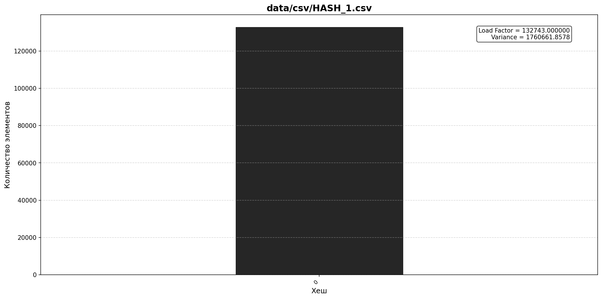

Очевидно, плохая хеш-функция, огромная дисперсия и load-factor.

### 2. First char

Хеш-функция, возвращающая значения первого символа.

```C++
static u_int64_t HashFunc2 (char* str, int str_len)
{
    DEBUG_ASSERT (str != nullptr);

    return str[0];
}
```

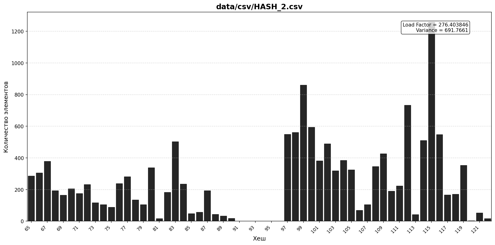

Как мы видим, все значения хешей в диапазоне от 60 до 100, это номера ASCII для латинских букв, так же очевдно, что хеш-функия плоха.

### 3. String lengh

Хеш-функция, возвращающая значения длины строки.

```C++
static u_int64_t HashFunc3 (char* str, int str_len)
{
    DEBUG_ASSERT (str != nullptr);

    return str_len;
}
```

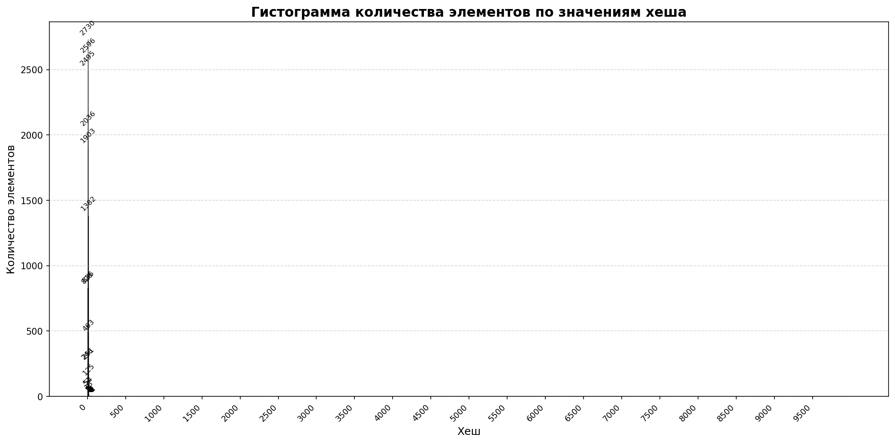

Хеш-функция напоминает какое-то нормальное распределение, интересный результат, но все таки свои задачи эта хеш-функция не выполняет.

### 4. ASCII sum

Хеш-функция, возвращающая сумму всех ASCII номеров в строке.

```C++
static u_int64_t HashFunc4 (char* str, int str_len)
{
    u_int64_t hash = 0;

    for (int i = 0; i < str_len; i++) {
        hash += str[i];
    }

    return hash;
}
```

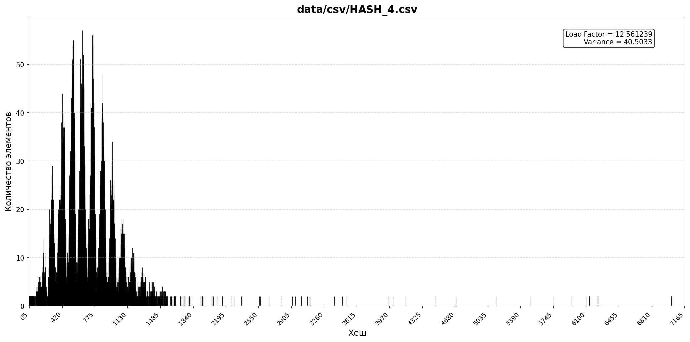

Наверное, самая интересная из всех демонстартивных хеш-функций, данных нам Дединским. Интересным является форма гистограммы. Естественное возрастание и падение, наличие пиков. Но все же колличество коллизий функция слабо уменьшает. Поэтому перейдем к существующим хеш-функиям.

### 5. DJB2

Простая, быстрая и эффективная хеш-функция, предложенная Даниэлем Дж. Бернштейном (djb) для строк. Она инициализируется числом 5381 и использует число 33.

```C++
static u_int64_t HashFunc5 (char* str, int str_len)
{
    u_int64_t hash = 0;

    for (int i = 0; i < str_len; i++) {
        hash = (hash << 5) + hash + str[i];
    }

    return hash;
}
```

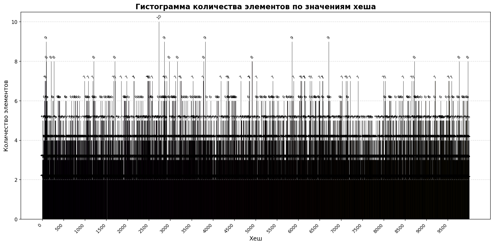

Это уже качественная хеш-функция, load-factor = 2.47, отличный результат. Она и будет использовать в первой версии проекта.

## 4. Оптимизация

### 1. Первичные замеры

Для оптимизации проекта, естественно, нужно знать узкие места, места что мы будем оптимизировать. Поэтому проводим первичные замеры скорости работы:

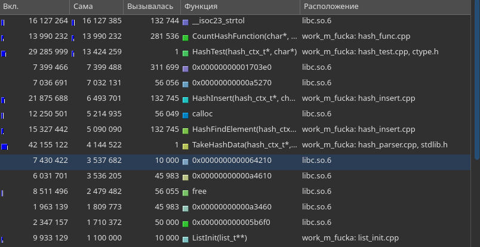

### 2. Оптимизации хеш-функции

Как мы видим, первое место, по времени занимает функция _strtoi_, она вызывается только на этапе инициализации таблицы, при считывании длины слова. В нашем use-case мы не берем в расчет время инициализации таблици, а потому оптимизировать ее попросу глупо.
А потому выбор функции для оптимизации пал на _CountHashFunction_, до оптимизации она имеет такой вид:
``` C++
u_int64_t CountHashFunction (char* str, int str_len)
{
    u_int64_t hash = 0;

#if defined (HASH_5)
    hash = HashFunc5 (str, str_len);
#elif defined (HASH_4)
    hash = HashFunc4 (str, str_len);
#elif defined (HASH_3)
    hash = HashFunc3 (str, str_len);
#elif defined (HASH_2)
    hash = HashFunc2 (str, str_len);
#elif defined (HASH_1)
    hash = HashFunc1 (str, str_len);
#else
    hash = HashFunc5 (str, str_len);
#endif
    return hash;
}
```
В ней используется условная компиляция, для возможности использовать учебные хеш-функции. При замерах используется флаг ```-D HASH_5```, то есть используется хеш-функция djb2:
```C++
static u_int64_t HashFunc5 (char* str, int str_len)
{
    u_int64_t hash = 0;

    for (int i = 0; i < str_len; i++) {
        hash = (hash << 5) + hash + str[i];
    }

    return hash;
}
```

Мною было решено заменить цикл, на ассемблерную встаку. Теперь функцуя имеет слудующий вид:
``` C++
static u_int64_t HashFunc5 (char* str, int str_len) 
{
    DEBUG_ASSERT (str != nullptr);

    u_int64_t result = 0;

    __asm__ volatile (
    "movq  $5381, %%rax\n"
    "movq  %1   , %%r8 \n"
    "movl  %2   , %%ecx\n"
    ".hash_count_loop: \n"

    "shlq   $2    , %%rax   \n"
    "leaq   (%%rax, %%rax, 8), %%rax   \n"
    "movq   (%%r8), %%rdx   \n"
    "addq   %%rdx , %%rax   \n"
    "incq   %%r8            \n"
    "loop   .hash_count_loop\n"

    : "=r" (result)
    : "r" (str), "r" (str_len)
    : "rax", "ecx", "rdx", "r8", "memory", "cc"
    );
    
    return (u_int64_t) result;
}
```

Теперь сравним диз-ассемблер двух версий:

``` asm
HashFunc5(char*, int):                        | "longHashFunc5(char*, int)":
                                              |
        push    rbp                           |     push    rbp
        mov     rbp, rsp                      |     mov     rbp, rsp
        mov     QWORD PTR [rbp-24], rdi       |     mov     QWORD PTR [rbp-24], rdi
        mov     DWORD PTR [rbp-28], esi       |     mov     DWORD PTR [rbp-28], esi
        mov     QWORD PTR [rbp-8],  0         |     mov     QWORD PTR [rbp-8], 0
        mov     DWORD PTR [rbp-12], 0         |     mov     rsi, QWORD PTR [rbp-24]
        jmp     .L2                           |     mov     edi, DWORD PTR [rbp-28]
.L3:                                          |     movq    $5381, %rax
        mov     rax, QWORD PTR [rbp-8]        |     movq    rsi  , %r8 
        sal     rax, 5                        |     movl    edi  , %ecx
        mov     rdx, rax                      | .hash_count_loop:
        mov     rax, QWORD PTR [rbp-8]        |     shlq    $2    , %rax   
        lea     rcx, [rdx+rax]                |     leaq    (%rax, %rax, 8), %rax   
        mov     eax, DWORD PTR [rbp-12]       |     movq    (%r8), %rdx   
        movsx   rdx, eax                      |     addq    %rdx , %rax  
        mov     rax, QWORD PTR [rbp-24]       |     incq    %r8     
        add     rax, rdx                      |     loop    .hash_count_loop
        movzx   eax, BYTE PTR [rax]           |     mov     QWORD PTR [rbp-8], rsi
        movsx   rax, al                       |     mov     rax, QWORD PTR [rbp-8]
        add     rax, rcx                      |     pop     rbp
        mov     QWORD PTR [rbp-8], rax        |     ret
        add     DWORD PTR [rbp-12], 1         |
.L2:                                          |
        mov     eax, DWORD PTR [rbp-12]       |
        cmp     eax, DWORD PTR [rbp-28]       |
        jl      .L3                           |
        mov     rax, QWORD PTR [rbp-8]        |
        pop     rbp                           |
        ret                                   |
```

В своей версии я хранил значение хеша в регистре, а потому в цикле у меня вообще нет обращений к памяти, коих в базовой реализации аж 7. А потому и выпонятся она гараздо быстрее. Замер скорости работы:

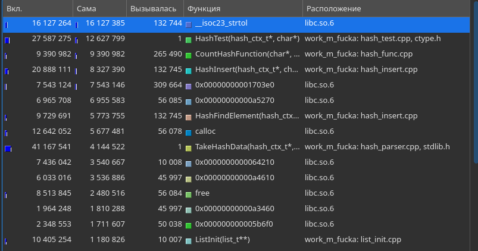

Профилировщик показывает ускорение в _13.9 / 9.3 = 1.5_, мы ускорили на 50%. Отличный результат, и оптимизировать ее уже некуда.

### 3. Оптимизация strcmp

Мы видем, что первую строчку топа после хеш-функции занимает неподписанная функция из stdlib, которая вызывается 300 тысяч раз, это strcmp. Чтобы ее оптимизировать, нам даже не обязательно ее переписывать. Сперва мы заменим предыдущее сравнение:

``` C++
for (int i = 1; i < target_list->size + 1; i++) {
        str_ctx_t str_ctx = target_list->data[i]; 
        if (strncmp (str, str_ctx.str, str_len) == 0) return true;
    }
```

На новое, где сперва сравниваются длины и хеши и уже при их совпадении, будут сравниваться сами строки:

``` C++
for (int i = 1; i < target_list->size + 1; i++) {
        str_ctx_t str_ctx = target_list->data[i]; 
        if (str_ctx.str_len != str_len) break;
        if (str_ctx.hash    != hash   ) break;
        if (strncmp (str, str_ctx.str, str_len) == 0) return true;
    }
```

Теоритически, такая оптимизация должна отбрасывать большое колличество возможных сравнений строк.

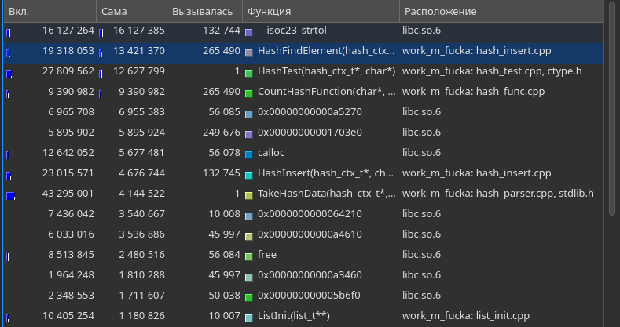

На практике, она нам дала сокращения сравнения строк примерно 20%, однако, мне кажется существенную роль играет малая БД и сравнимая в размерах БД для тестов, поэтому проведем те же тесты, но с базой данных из 370 тысяч уникальных слов, вместо 30 тысяч.  

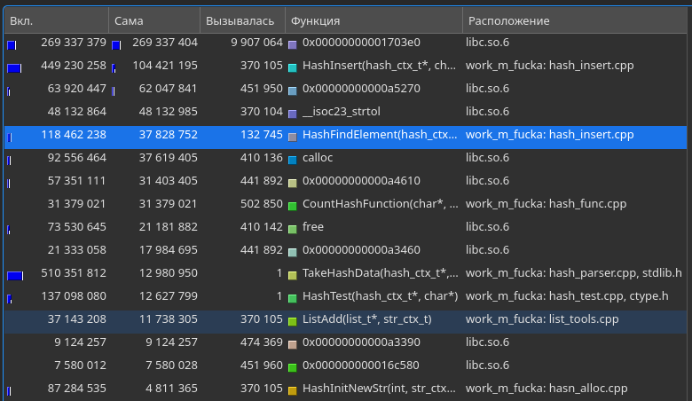

Вот это уже интересный эксперимент, 10 миллионов вызовов ```str_cmp```. Теперь проверим для оптимизированной версии:

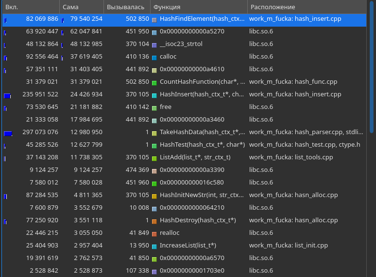

Теперь у нас всего 107 тысяч вызово ```str_cmp```. То есть мы избавились от 9907064 / 107338 = 92.29, мы избавились от 92% сравнений строк. Это конечно хорошо, но нужно же убедиться, что это в действительности оптимизация. Для этого взглянем на значения времени работы ```HashFindElement``` в столбце _вкл_, для измерения общего времени со всеми вызовами функций. Получаем ускорение в 118 462 238 / 82 069 886 = 1.44, ускорение на 44%.


### 4. Оптимизация

Обратимся к предыдущему замеру скорости. Видим, что большую часть времени занимают ```calloc``` ,```free``` и вызываемые ими функции. В нашем use-case они не оптимизируются, значит следующая на очереди ```HashFindElement```

``` C++
bool HashFindElement (hash_ctx_t* hash_ctx, char* str, int str_len, u_int64_t hash)
{
    DEBUG_ASSERT (hash_ctx != nullptr);

    list_t* target_list = hash_ctx->src[hash % kHashMapCap];
    if (target_list == nullptr) {
        PRINTERR (target_list == nullptr);
        return false;
    }

    const char *target_str = str;
size_t target_len = str_len;
uint32_t target_hash = hash;
for (int i = 1; i <= target_list->size; ++i) {
    str_ctx_t *item = &target_list->data[i];
    if (item->str_len == target_len && item->hash == target_hash) {
        if (memcmp(target_str, item->str, target_len) == 0) return true;
    }
}

    return false;
}
```

Профлировщик, погзволяет нам смотреть затраты прямо в коде.

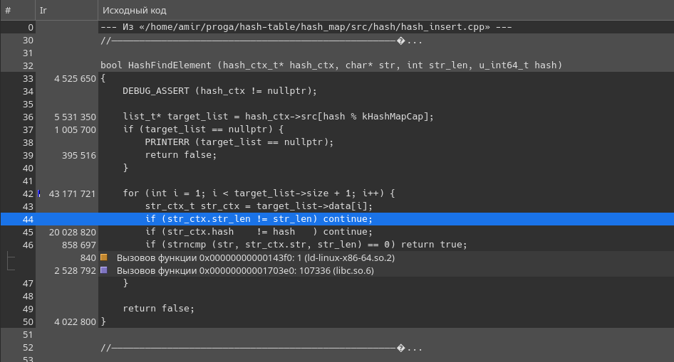

Из измерений видем, что цикл сравненый занимает 60 миллионов тактов.
Посмотрим, как раскрывается данная функция:

``` asm
;arguments in registers: RDI, RSI, RDX, RCX, R8, R9
;caller  save registers: RDI, RSI, RDX, RCX, R8, R9, RAX, R10, R11

;==============================================
;shift rsp
        sub     rsp, 56
;save r13 value
        mov     QWORD PTR [rsp+32], r13
;save str_len into r13
        movsxd  r13, edx

;==============================================
list_t* target_list = hash_ctx->src[hash % kHashMapCap];
;r8 = hash
        mov     r8, rcx

        movabs  rax, -6691484059914626997
        mul     rcx
        mov     rax, rcx
        sub     rax, rdx
        shr     rax
        add     rdx, rax
        mov     rax, QWORD PTR [rdi]
        shr     rdx, 13
        imul    rdx, rdx, 10007
        sub     r8, rdx
;rax = target_list
        mov     rax, QWORD PTR [rax+r8*8]
    
;==============================================
;if (target_list == nullptr) return error_code
        test    rax, rax
        je      .L4

;==============================================
;save r15
        mov     QWORD PTR [rsp+48], r15
;int size = target_list->size + 1;
        mov     r15d, DWORD PTR [rax+36]
;if size <= 0 return...
        test    r15d, r15d
        jle     .L10
;save rbx
        mov     QWORD PTR [rsp+8], rbx
;rbx = str_ctx
        mov     rbx, QWORD PTR [rax]
;save rbp
        mov     QWORD PTR [rsp+16], rbp
        mov     ebp, 1
;save r12
        mov     QWORD PTR [rsp+24], r12
;rbx = str_len
        add     rbx, 24
;r12 = hash
        mov     r12, rcx
;save r14
        mov     QWORD PTR [rsp+40], r14
;r14 = str
        mov     r14, rsi
        jmp     .L6
.L5:
;go to next compare
        add     ebp, 1
        add     rbx, 24
;if cur_el > list_size jmp end
        cmp     r15d, ebp
        jl      .L12

;==============================================

.L6:

;jmp .l5 if hash != target_hash
        cmp     QWORD PTR [rbx+8], r12
        jne     .L5
;jmp .l5 if str_len != str_len
        cmp     QWORD PTR [rbx], r13
        jne     .L5
        mov     rsi, QWORD PTR [rbx+16]
        mov     rdx, r13
        mov     rdi, r14
        call    "memcmp"
        test    eax, eax
        jne     .L5

;find word
        mov     rbx, QWORD PTR [rsp+8]
        mov     rbp, QWORD PTR [rsp+16]
        mov     eax, 1
        mov     r12, QWORD PTR [rsp+24]
        mov     r14, QWORD PTR [rsp+40]
        mov     r15, QWORD PTR [rsp+48]
        mov     r13, QWORD PTR [rsp+32]
        add     rsp, 56
        ret
.L12:
        mov     rbx, QWORD PTR [rsp+8]
        mov     rbp, QWORD PTR [rsp+16]
        mov     r12, QWORD PTR [rsp+24]
        mov     r14, QWORD PTR [rsp+40]
        mov     r15, QWORD PTR [rsp+48]
.L4:
        mov     r13, QWORD PTR [rsp+32]
        xor     eax, eax
        add     rsp, 56
        ret
.L10:
        mov     r15, QWORD PTR [rsp+48]
        jmp     .L4
```

Во первых уберем всесохранения caller-save регистров. К сожалению ни один из этих регистров не сохраняется. Однако мы можем заменить регистры r12, r13, r14 и r15 на регистры r8, r9,10 и r11, которые сохранять не нужно, а потому и обращений к памяти будет меньше.

``` asm
;arguments in registers: RDI, RSI, RDX, RCX, R8, R9
;caller  save registers: RDI, RSI, RDX, RCX, R8, R9, RAX, R10, R11

;==============================================
;shift rsp
        sub     rsp, 16
;save str_len into r11
        movsxd  r11, edx

        mov [rsp     ], rdx
        mov [rsp + 8 ], rcx
        mov [rsp + 16], rsi

;==============================================
list_t* target_list = hash_ctx->src[hash % kHashMapCap];
;r8 = hash

        mov     r8, rcx
        movabs  rax, 0x68DB8BAD69ED7A99
        mul     rcx
        shr     rdx, 16
        imul    rdx, rdx, 10007
        sub     r8, rdx

;rax = target_list
        mov     rax, QWORD PTR [rax+r8*8]
    
;==============================================
;if (target_list == nullptr) return error_code
        test    rax, rax
        je      .L4

;==============================================

;int size = target_list->size + 1;
        mov     r10d, DWORD PTR [rax+36]
;if size <= 0 return...
        test    r10d, r10d
        jle     .L4
;rdi = str_ctx
        mov     rdi, QWORD PTR [rax]
        mov     esi, 1
;rdi = str_len
        add     rdi, 24
;r9 = hash
        mov     r9, rcx
;r8 = str
        mov     r8, rsi
        jmp     .L6
.L5:

;go to next compare
        add     esi, 1
        add     rdi, 24
;if cur_el > list_size jmp end
        cmp     r10d, esi
        jl      .L4

;==============================================

.L6:

;jmp .l5 if hash != target_hash
        cmp     QWORD PTR [rdi+8], r9
        jne     .L5
;jmp .l5 if str_len != str_len
        cmp     QWORD PTR [rdi], r11
        jne     .L5
        mov     rsi, QWORD PTR [rdi+16]
        mov     rdx, r11
        mov     rdi, r8
        call    "memcmp"
        test    eax, eax
        jne     .L5

;find word
        mov     eax, 1
        add     rsp, 56
        ret

.L4:
        xor     eax, eax
        add     rsp, 16
        ret
```

К сожалению, заменяя callee-saved регистры функция всегда падает в сегфолт, потому что memcmp ломает регистры, а сохранять их на стеке не целесообразно, так же как и просто сохранение 3 calle-saved регистров. Мною написанная версия оказалась на 25% медленее. Поэтому на этом оптимизация HashFindElement заканчивается